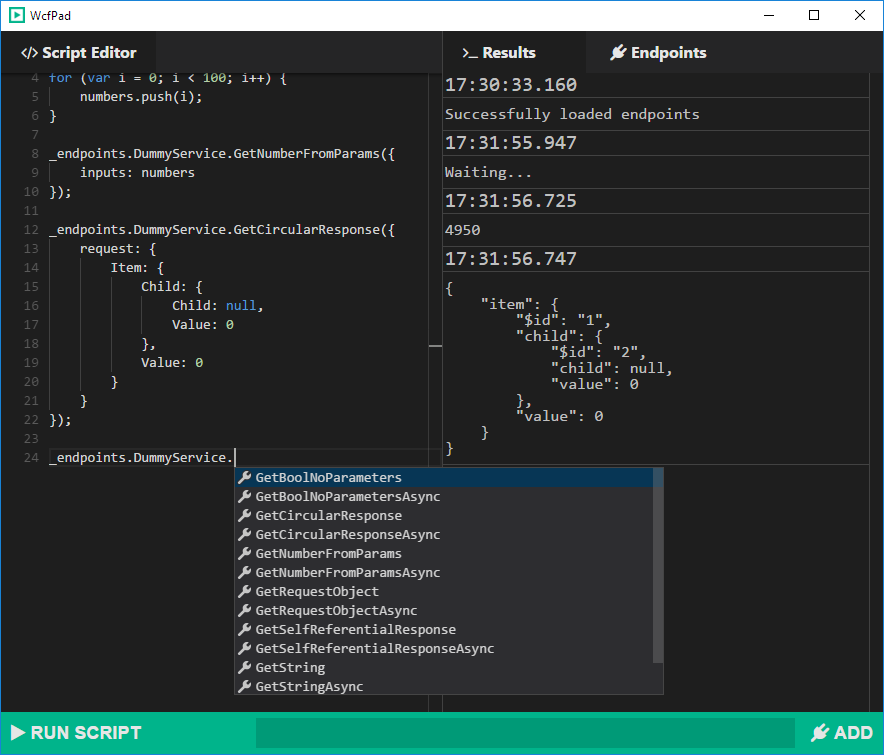

# WcfPad

*A developer-friendly alternative to WcfTestClient*

### Installation

Download the .exe installer from the [releases page](https://github.com/21robin12/wcfpad/releases)

### Features

 - Endpoints are saved even when closing WcfPad
 - Write reusable scripts to call WCF methods
 - Use Javascript logic to build up data before calling WCF methods
 - Easily manage multiple services with renaming
 - Use autocomplete to browse available WCF methods
 

